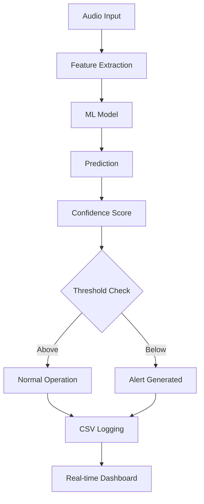

# FrED Predictive Maintenance System

[](https://opensource.org/licenses/MIT)
[](https://www.python.org/downloads/)

## � Prerequisites

Before the workshop session, ensure you have:

- **🐍 Anaconda Distribution** - Download from [anaconda.com](https://www.anaconda.com/products/distribution)
- **📓 Jupyter Notebook** - Included with Anaconda installation
- **🎤 Audio Input Device** - Contact microphone provided by instructors
- **�️ Compatible Operating System** - Windows, macOS, or Linux

---

A comprehensive predictive maintenance system that uses audio analysis and machine learning to detect equipment faults and anomalies in industrial machinery.

## 🎯 Overview

FrED (Fault Recognition and Equipment Diagnostics) is an advanced predictive maintenance platform that leverages:
- **Audio Signal Processing** for real-time machinery health monitoring
- **Machine Learning Models** for fault classification and prediction
- **Interactive Jupyter Notebooks** for data collection and analysis
- **Real-time Monitoring Interface** with continuous updates and alerts

## 🚀 Features

### Core Functionality
- **Real-time Audio Monitoring** - Continuous machinery health assessment
- **Multi-class Fault Detection** - Identifies various equipment conditions (Good, Chipped Tooth, etc.)
- **Confidence-based Alerting** - Configurable thresholds for predictive alerts
- **Data Logging & Export** - Automatic CSV logging with machine identification
- **Interactive UI** - Professional industrial-style monitoring interface

### Advanced Features
- **Enhanced Live Inspector** - Real-time graphs updating every 2 seconds
- **Machine ID Management** - Multi-machine monitoring capabilities
- **Background Processing** - Non-blocking continuous operation
- **Automatic Data Backup** - Configurable auto-save intervals
- **Comprehensive Metrics** - Performance tracking and analytics


## 🛠️ Installation
### Jupyter Notebook Setup

**🚀 Getting Started:**
1. **Launch Anaconda Navigator** or use command line
2. **Start Jupyter Notebook** from Anaconda Navigator or run `jupyter notebook`
3. **Navigate to the repository folder** in Jupyter's file browser
4. **Open the audio recorder notebook:** `audio_recorder_local.ipynb`

**� Workshop Notebooks:**
- **`audio_recorder_shared.ipynb`** - Record and collect machinery audio samples locally
- **`Predictive Maintenance Workshop.ipynb`** - Complete workflow and analysis


## � Interactive Notebooks

### 🛠️ Complete Workshop
**[Predictive Maintenance Workshop](https://colab.research.google.com/github/Ibrahimhk98/FrED-Predictive-Maintenance/blob/main/Predictive%20Maintenance%20Workshop.ipynb?v=2025-10-28)** [](https://colab.research.google.com/github/Ibrahimhk98/FrED-Predictive-Maintenance/blob/main/Predictive%20Maintenance%20Workshop.ipynb)
- **Purpose**: End-to-end predictive maintenance workflow
- **Features**: Feature extraction, model training, real-time monitoring
- **Best For**: Learning the complete pipeline, hands-on tutorial


## 🔍 Key Components

### Audio Processing
- **Multi-format Support** - WAV, MP3, and other audio formats
- **Real-time Processing** - Low-latency audio analysis
- **Feature Engineering** - Advanced signal processing techniques
- **Noise Reduction** - Filtering and preprocessing capabilities

### Machine Learning
- **Classification Models** - Support for various ML algorithms
- **Confidence Scoring** - Probability-based predictions
- **Model Persistence** - Save and load trained models
- **Batch Processing** - Handle multiple audio files efficiently

### User Interface
- **Jupyter Integration** - Interactive notebook environment
- **Real-time Visualization** - Live updating charts and graphs  
- **Professional Design** - Industrial-style monitoring interface
- **Export Capabilities** - CSV data export with metadata

## 📊 Data Flow




## 📝 Documentation

- **[Features Documentation](FEATURES_DOCUMENTATION.md)** - Detailed feature specifications
- **Notebook Examples** - Interactive tutorials and examples
- **API Reference** - Function and class documentation
- **Best Practices** - Guidelines for optimal usage

## 🐛 Troubleshooting

### Common Issues

**Microphone Permission Denied (macOS)**
```bash
# Grant microphone access in System Preferences
System Preferences → Security & Privacy → Privacy → Microphone
```

**Module Import Errors**
```bash
# Ensure you're in the project directory
cd FrED-Predictive-Maintenance
pip install -r requirements.txt
```

**Audio Device Not Found**
```python
# List available devices
from Preparation.Import.audio_recorder import list_audio_devices
devices = list_audio_devices()
print('\n'.join(devices))
```

## 📈 Performance

### System Requirements
- **CPU**: Multi-core processor recommended for real-time processing
- **RAM**: 4GB minimum, 8GB recommended
- **Storage**: 1GB for base installation, additional space for audio data
- **Audio**: Compatible microphone or audio input device

### Optimization Tips
- Use appropriate buffer sizes for your system
- Configure auto-save intervals based on storage capacity
- Monitor CPU usage during continuous operation
- Adjust confidence thresholds based on model performance

## 📄 License

This project is licensed under the MIT License - see the [LICENSE](LICENSE) file for details.

## 👥 Authors

- **Ibrahim Elkhatib** - *Project Lead* - [@Ibrahimhk98](https://github.com/Ibrahimhk98)
