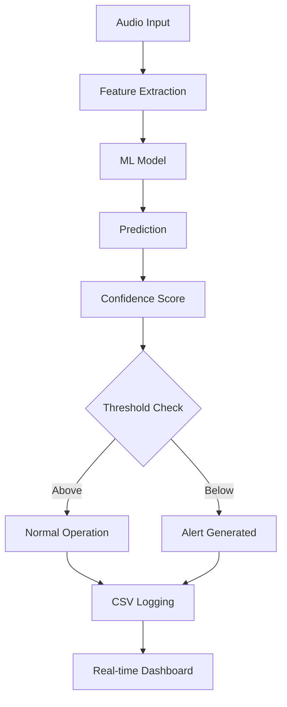

# FrED Predictive Maintenance System

[](https://opensource.org/licenses/MIT)
[](https://www.python.org/downloads/)

A comprehensive predictive maintenance system that uses audio analysis and machine learning to detect equipment faults and anomalies in industrial machinery.

## 🎯 Overview

FrED (Fault Recognition and Equipment Diagnostics) is an advanced predictive maintenance platform that leverages:
- **Audio Signal Processing** for real-time machinery health monitoring
- **Machine Learning Models** for fault classification and prediction
- **Interactive Jupyter Notebooks** for data collection and analysis
- **Real-time Monitoring Interface** with continuous updates and alerts

## 🚀 Features

### Core Functionality
- **Real-time Audio Monitoring** - Continuous machinery health assessment
- **Multi-class Fault Detection** - Identifies various equipment conditions (Good, Chipped Tooth, etc.)
- **Confidence-based Alerting** - Configurable thresholds for predictive alerts
- **Data Logging & Export** - Automatic CSV logging with machine identification
- **Interactive UI** - Professional industrial-style monitoring interface

### Advanced Features
- **Enhanced Live Inspector** - Real-time graphs updating every 2 seconds
- **Machine ID Management** - Multi-machine monitoring capabilities
- **Background Processing** - Non-blocking continuous operation
- **Automatic Data Backup** - Configurable auto-save intervals
- **Comprehensive Metrics** - Performance tracking and analytics

## 📁 Project Structure

```
FrED-Predictive-Maintenance/
├── 📊 Notebooks/
│   ├── audio_recorder_local.ipynb      # Local audio recording interface
│   ├── audio_recorder_colab.ipynb      # Google Colab version with Drive integration
│   ├── audio_and_encoder.ipynb         # Audio processing and encoding
│   ├── regression_example.ipynb        # Regression analysis examples
│   └── Predictive Maintenance Workshop.ipynb
│
├── 🔧 Preparation/
│   ├── Import/
│   │   ├── audio_recorder.py           # Audio recording utilities
│   │   └── audio_and_encoder.py        # Audio processing functions
│   │
│   └── Sample Preparation/
│       ├── Feature_extraction_pipeline/
│       │   ├── features_extractor.py   # Feature extraction algorithms
│       │   ├── orchestrator.py         # Pipeline orchestration
│       │   ├── rich_features.py        # Advanced feature engineering
│       │   └── splitters.py           # Data splitting utilities
│       │
│       ├── Models/
│       │   ├── enhanced_live_inspector_ui.py  # Advanced monitoring UI
│       │   ├── live_inspector.py       # Real-time monitoring core
│       │   ├── model_predictor.py      # ML model inference
│       │   └── batch_predict.py        # Batch prediction utilities
│       │
│       └── Performance_metrics/
│           └── metrics.py              # Model evaluation metrics
│
├── 📁 Data/
│   └── audio/
│       ├── Good/                       # Healthy machinery samples
│       └── Chipped Tooth/              # Fault condition samples
│
├── 📋 requirements.txt                 # Python dependencies
├── 📄 FEATURES_DOCUMENTATION.md       # Detailed feature documentation
└── 📖 README.md                       # This file
```

## 🛠️ Installation

### Prerequisites
- Python 3.8 or higher
- Audio input device (microphone)
- Jupyter Notebook environment

### Local Setup

1. **Clone the repository:**
```bash
git clone https://github.com/Ibrahimhk98/FrED-Predictive-Maintenance-.git
cd FrED-Predictive-Maintenance-
```

2. **Install dependencies:**
```bash
pip install -r requirements.txt
```

3. **Grant microphone permissions** (macOS users):
   - System Preferences → Security & Privacy → Privacy → Microphone
   - Enable access for your terminal/IDE

### Google Colab Setup

1. **Open the Colab notebook:**
   - Use `audio_recorder_colab.ipynb` for cloud-based recording
   - Automatically handles repository cloning and dependency installation

2. **Mount Google Drive:**
   - The notebook will prompt you to authorize Drive access
   - Data is saved to shared drives for collaboration

## 🎯 Quick Start

### 1. Audio Recording
```python
from Preparation.Import.audio_recorder import create_recorder_ui

# Create recording interface
ui = create_recorder_ui(base_dir="data/audio")
display(ui)
```

### 2. Real-time Monitoring
```python
from Preparation.Sample_Preparation.Models.enhanced_live_inspector_ui import display_enhanced_ui

# Launch enhanced monitoring interface
display_enhanced_ui(inspector)
```

### 3. Feature Extraction
```python
from Preparation.Sample_Preparation.Feature_extraction_pipeline.orchestrator import FeatureOrchestrator

# Extract features from audio data
orchestrator = FeatureOrchestrator()
features = orchestrator.extract_features(audio_data)
```

## 📚 Usage Examples

### Basic Audio Recording
The audio recorder provides an intuitive interface for collecting machinery audio samples:

- **Device Selection** - Choose from available microphones
- **Duration Control** - Set recording length (1-10 seconds)
- **Defect Classification** - Organize samples by condition type
- **Automatic Saving** - Files saved with timestamps and metadata

### Enhanced Live Monitoring
The enhanced live inspector offers professional-grade monitoring:

```python
# Key features of the enhanced UI:
✅ Real-time graph updates every 2 seconds
✅ Automatic CSV data logging with machine IDs  
✅ Configurable confidence thresholds
✅ Background threading for continuous operation
✅ Professional alert system with visual indicators
✅ Multi-machine monitoring support
```

### Machine Learning Pipeline
```python
# Complete workflow example:
1. Record audio samples → audio_recorder.py
2. Extract features → features_extractor.py  
3. Train models → model_predictor.py
4. Real-time monitoring → enhanced_live_inspector_ui.py
5. Performance analysis → metrics.py
```

## 🔍 Key Components

### Audio Processing
- **Multi-format Support** - WAV, MP3, and other audio formats
- **Real-time Processing** - Low-latency audio analysis
- **Feature Engineering** - Advanced signal processing techniques
- **Noise Reduction** - Filtering and preprocessing capabilities

### Machine Learning
- **Classification Models** - Support for various ML algorithms
- **Confidence Scoring** - Probability-based predictions
- **Model Persistence** - Save and load trained models
- **Batch Processing** - Handle multiple audio files efficiently

### User Interface
- **Jupyter Integration** - Interactive notebook environment
- **Real-time Visualization** - Live updating charts and graphs  
- **Professional Design** - Industrial-style monitoring interface
- **Export Capabilities** - CSV data export with metadata

## 📊 Data Flow



## 🤝 Contributing

We welcome contributions! Please follow these steps:

1. **Fork the repository**
2. **Create a feature branch** (`git checkout -b feature/AmazingFeature`)
3. **Commit your changes** (`git commit -m 'Add some AmazingFeature'`)
4. **Push to the branch** (`git push origin feature/AmazingFeature`)
5. **Open a Pull Request**

### Development Guidelines
- Follow PEP 8 style guidelines
- Add docstrings to all functions
- Include unit tests for new features
- Update documentation as needed

## 📝 Documentation

- **[Features Documentation](FEATURES_DOCUMENTATION.md)** - Detailed feature specifications
- **Notebook Examples** - Interactive tutorials and examples
- **API Reference** - Function and class documentation
- **Best Practices** - Guidelines for optimal usage

## 🐛 Troubleshooting

### Common Issues

**Microphone Permission Denied (macOS)**
```bash
# Grant microphone access in System Preferences
System Preferences → Security & Privacy → Privacy → Microphone
```

**Module Import Errors**
```bash
# Ensure you're in the project directory
cd FrED-Predictive-Maintenance-
pip install -r requirements.txt
```

**Audio Device Not Found**
```python
# List available devices
from Preparation.Import.audio_recorder import list_audio_devices
devices = list_audio_devices()
print('\n'.join(devices))
```

## 📈 Performance

### System Requirements
- **CPU**: Multi-core processor recommended for real-time processing
- **RAM**: 4GB minimum, 8GB recommended
- **Storage**: 1GB for base installation, additional space for audio data
- **Audio**: Compatible microphone or audio input device

### Optimization Tips
- Use appropriate buffer sizes for your system
- Configure auto-save intervals based on storage capacity
- Monitor CPU usage during continuous operation
- Adjust confidence thresholds based on model performance

## 📄 License

This project is licensed under the MIT License - see the [LICENSE](LICENSE) file for details.

## 👥 Authors

- **Ibrahim Elkhatib** - *Project Lead* - [@Ibrahimhk98](https://github.com/Ibrahimhk98)

## 🙏 Acknowledgments

- Industrial partners providing real-world machinery data
- Open source audio processing libraries
- Machine learning research community
- Contributors and beta testers

## 📞 Support

For questions, issues, or feature requests:
- **GitHub Issues** - [Report bugs or request features](https://github.com/Ibrahimhk98/FrED-Predictive-Maintenance-/issues)
- **Discussions** - [Community discussions and Q&A](https://github.com/Ibrahimhk98/FrED-Predictive-Maintenance-/discussions)

---

*Built with ❤️ for predictive maintenance and industrial IoT applications*